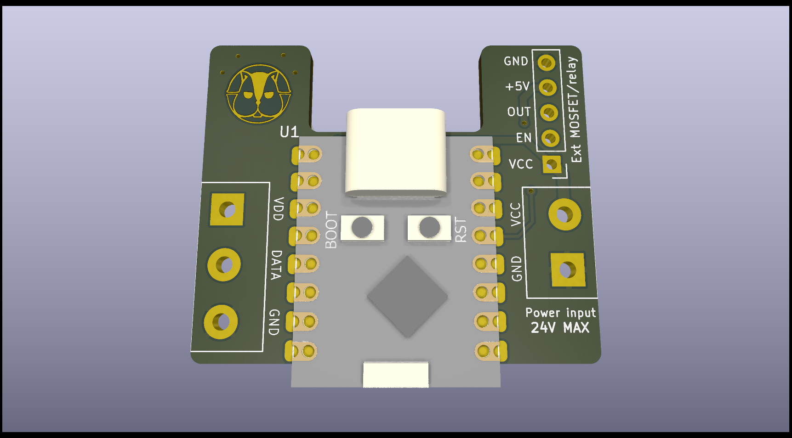
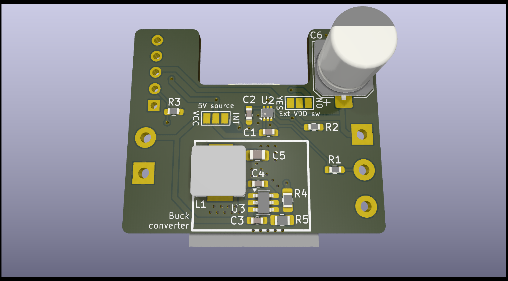

# Kurumi

Addressable LED strip controller, based on the ESP32-C3 SuperMini.  
This is a shrinkage of a previous private project that was quite janky due to
my friend's needs.

**WARNING: currently not working properly.**

Designed to run at 5V or any voltage between 12V and 24V.  
In case of 5V strips, the buck converter part won't need to be populated;
instead, short jumper JP1's central pin to VCC.  
**DON'T DO THIS FOR ANY VOLTAGE OVER 5V OR YOU WILL FRY YOUR ESP32.**  

For strips running at 12V or more, short JP1 to INT (internal converter).  
**The buck converter is not designed for voltages over 24V.**  

The data pin is connected to GPIO5, at the moment no ESPhome or WLED
configuration has been made, you'll have to spin your own until I get the board
and test everything.  

The board also supports using relays or MOSFETs to cut power to the strip by
using the broken out pins J3. The EN pin is connected to GPIO4 and can be used
to control the switching device. Don't forget to short JP2 as needed, whether
you want to switch the power or not.  

It's recommended to add insulation over the jumpers and on unpopulated pads on
the bottom if the buck converter is not used (i.e. electrical or kapton tape).  

